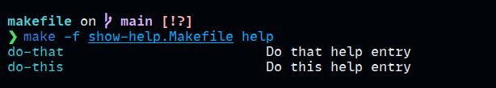

# awesome-makefile

Tips and tricks with Makefile

## show help

Require `awk`. See [`show-help.Makefile`](./show-help.Makefile).

The magic is this 5 lines

```make
help: # Display help
	@awk -F ':|##' \
		'/^[^\t].+?:.*?##/ {\
			printf "\033[36m%-30s\033[0m %s\n", $$1, $$NF \
		}' $(MAKEFILE_LIST) | sort
```

Example output


